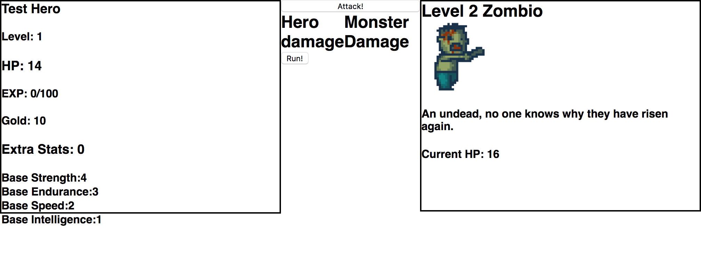

# __Ultimate RPG__

The Ultimate RPG.

A never ending, forever growing and infinitely difficult rpg for players to grind and struggle against monsters. Who can make it the farthest?

1. **[An Explanation](#An-Explanation)**
2. **[Features](#Features)**

### An Explanation

Ultimate RPG is a project i have been steadily working on for the past year. The original goal was to help practice react and javascript skills with 
interesting problems and user interaction but has continually grown beyond my initial expectations. As I built new features more and more ideas would
fill my head and eventually this idea of an infinite and deep RPG system started to take shape. It's still early in it's concept and I'm working on it
solo but i plan on continuing to build and add features to make the Ultimate RPG into a true game. 
  

### Features
	*feature not yet complete

* Create your own personal heroes and level them up against monsters.
  
* *Receive a unique charm that grows with the user.
* *Heroes can die but even with death you can still grow.
* Difficulty increases the farther you travel. (be careful of your location)
* *Can buy and equip gear for stat increase.
* *Monsters drop gear, materials, experience and money for the player.
* Turn based combat.
  
* One big shared map for all users. (other players not visible)
  
* Map is unlocked as players discover it. 
* *Many abilities can be unlocked and used.
* Pixel art app for users to draw personal hero image, item and monster art that may be used in game for all users to see.
  